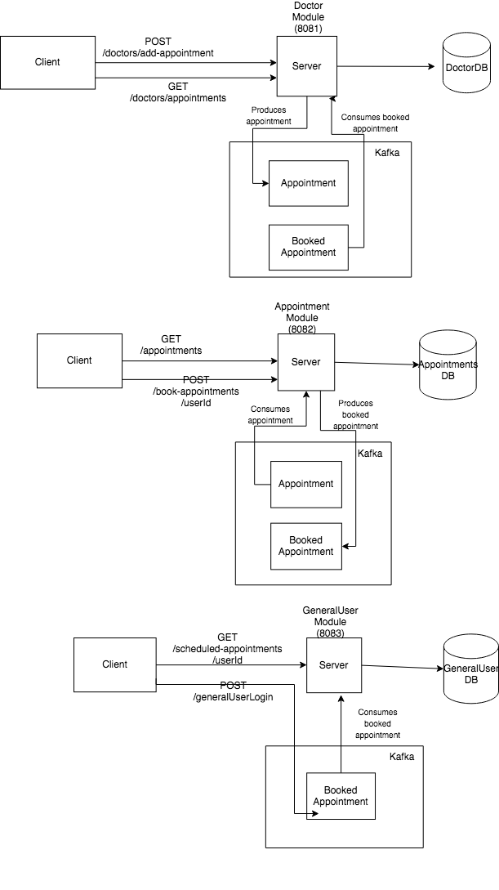

<h1>Sanitaria</h1>

The name is derived from the Italian transaltion for the word "healthcare".

<h1> Features Implemented </h1>
<ul>
<li>User registration for 3 roles - Doctor, Patient, User Registration</li>
<li>REST APIs to perform CRUD operations on all three roles.</li>
<li>Mongodb to persist data.</li>
<li>MVC architecture/ folder structure</li>
<li>Authorisation using JWT and password hashing</li>
<li>Using kafka to communicate between different microservices.</li>
<li>Logger service to generate server logs</li>
<li>Swagger to document APIs</li>
</ul>

<h1> Modules in the application </h1>
<ul>
<li>Doctor Module - PORT 8081</li>
<li>Appointment Module - PORT 8082</li>
<li>GeneralUser Module - PORT 8083</li>
<li>Patient Module - PORT 8084</li>
</ul>

<h1> How is Kafka used</h1>
<ul>
<li>POST request (/doctors/add-appointment) to doctorModule to add a new appointment.</li>
<li>Added appointment details is produced to "appointment" topic.</li>
<li>Added appointment is consumed by appointment module and stored in appointmentDB.</li>
<li>GET request(/appointments) fetches from appointmentDB and displays available appointments.</li>
<li>POST request(/book-appointment/userId) to appointment module to book an appointment slot.</li>
<li>Booked appointment details is produced to "booked-appointment" topic.</li>
<li>Booked appointment details are consumed by both generalUser module and doctorModule and corresponding DB updates are performed.</li>
</ul>

<h1>Kafka Workflow</h1>

