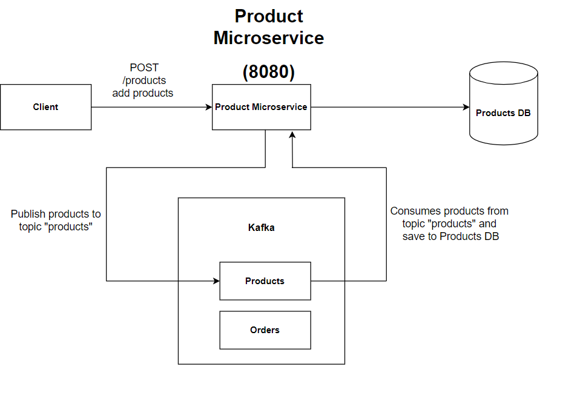
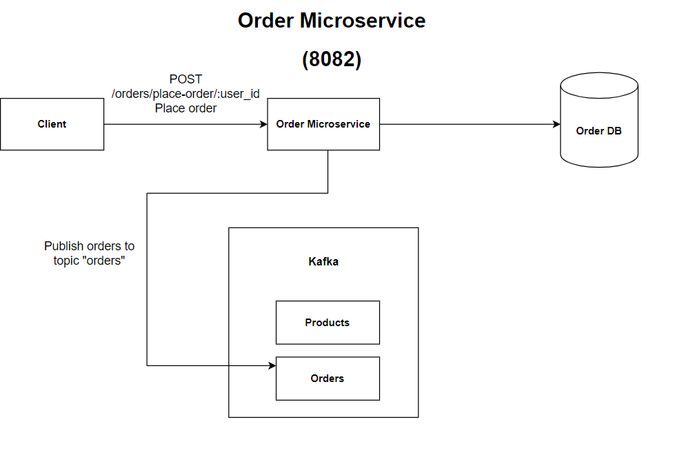
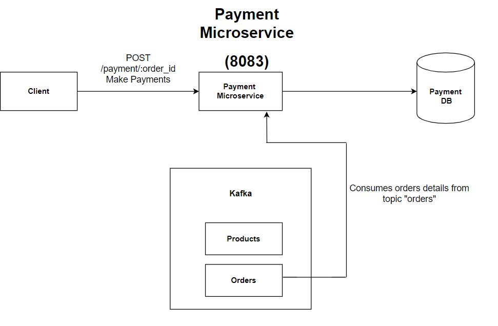
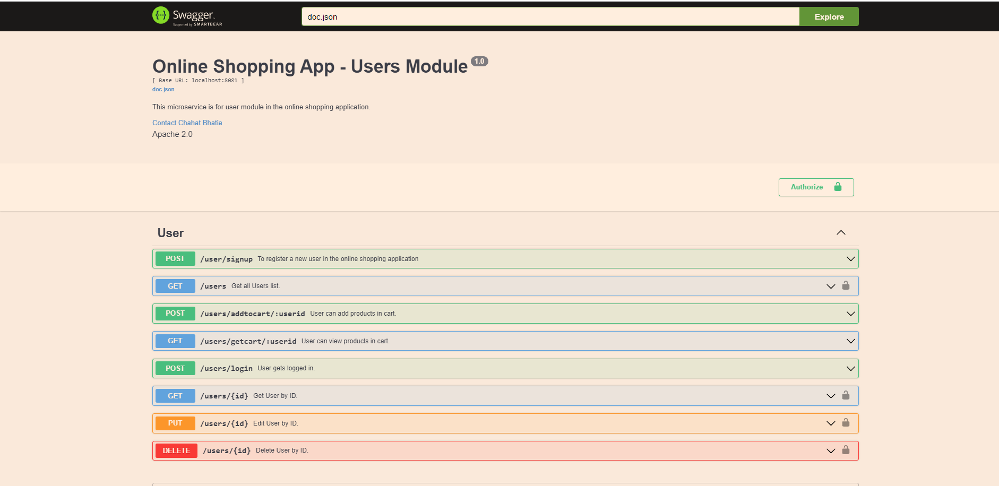
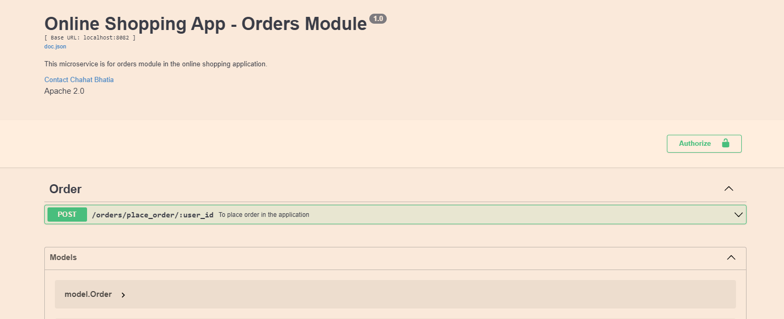
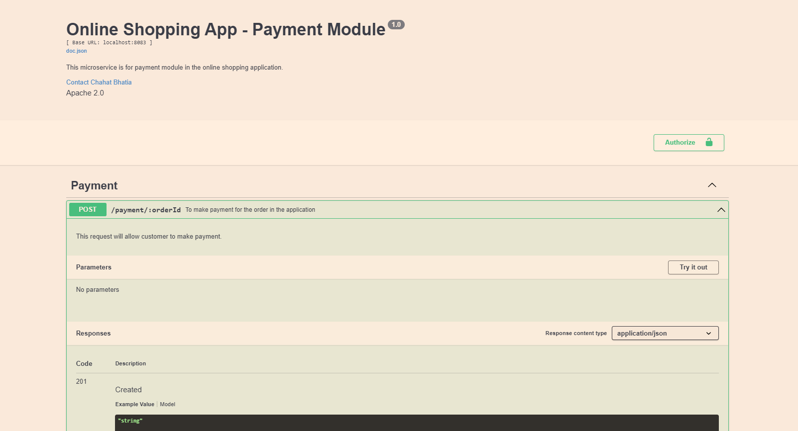
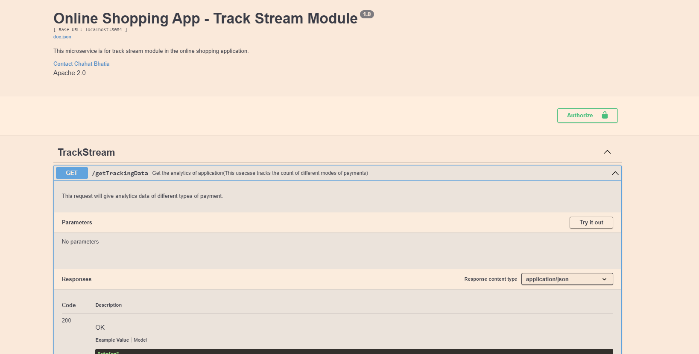

## Online Shopping Application

### Features Implemented

<li>Role-Right Management-registration for 2 roles - Admin, User Registration
<li>REST APIs to perform CRUD operations 
<li>Mongodb to persist data(User REST API - Gin + JSON data)
<li>MVC architecture/ folder structure for each microservice
<li>JWT Authentication
<li>Password Hashing
<li>Using kafka to communicate between different microservices.
<li>Logger service to generate server logs
<li>Sonarqube
<li>Swagger to document APIs
<li>Unit testing for all the API's
<li>Tested all microservices individual API's in Postman.

### API's
   #### Product Module (8080)
   <li> GET("/products")
   <li> POST("/products")
   <li> DELETE("/products/:product_id")
    <li> GET("/products/:product_id")
	<li> PUT("/products/:product_id")
	

   #### User Module (8081)
   <li> POST("/users/signup")
   <li>	POST("/users/login")
   <li> POST("/users/addtocart/:user_id")
   <li> GET("/users/getcart/:user_id")
   <li> GET("/users/:id")
   <li> PUT("/users/:id")
   <li> DELETE("/users/:id")
   <li> GET("/users")

   #### Order Module (8082)
   <li> POST("/orders/place_order/:user_id")

   #### Payment Module (8083)
   <li>  POST("/payment/:order_id")

   #### Track-stream Module (8084) {This service can be used for data-analytics like tracking user's choice of products or user's choice of payment mode and caan be used for recommmendation system}
   <li>	GET ("/getAnalytics")

### Modules in the application

<li>Product Module    - PORT 8080
<li>User Module     - PORT 8081
<li>Order Module     - PORT 8082
<li>Payment Module  - PORT 8083 
<li>Track-Stream Module  - PORT 8084 

 

<h1> How is Kafka used</h1>
<ul>
<li>PRODUCT SERVICE - POST request (/products) to add all products , all the products added will be produced to "Products" topic in kafka and then kafka can consume and save all the products to database.</li>
<li>ORDER SERVICE - POST request (/orders/place-order/:userid) to place order , the orders will be produced in kafka to "Orders" topic.</li>
<li>PAYMENT SERVICE - As soon any order is produced , payment service will consume the order details from "Orders" topic and do computation for processing payments.</li>
<li>TRACK-STREAM-SERVICE - This will consume the orders from order topic and will do the analytics required and will also store the analytics in the database.</li>
</ul>

 

## Product Service

 

## Order Service

 

## Payment Service

 

## Track-stream Service

## Setup

1. zookeper - `bin/zookeeper-server-start.sh config/zookeeper.properties`
2. kafka - `bin/kafka-server-start.sh config/server.properties`
3. Run `go run main.go` in each microservice
 
 ### Swagger ScreenShots

  #### User Module

 #### Product Module

 #### Order Module

 #### Payment Module

 #### Tracking Module

