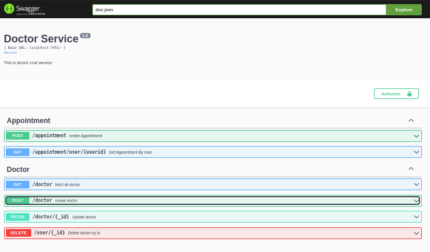

# Doctor & Appointment Service

- Create Update Delete Doctors
- Get all Doctors
- Get all Appointments of a specific user (by userid)
- Make Appointment for a User. This makes a call to user service for fetching user details
- logs are generated in file  /doctor_service/doctor_service.log


## Interactions

- To Create Appointment a rest api call is made to __user service__ to get user details.

- On creating a Appointment. A msg is published on __kafka__ to send to __notification service__ to send Appointment Confirmation Email. [Producer](producer/producer.go)


## Port = 7451

## Stack
- Gin
- MongoDb
- Swagger http://localhost:7451/swagger/index.html#/


### Swagger


### Generate Swagger Docs
```
/home/neo/go/bin/swag init
```