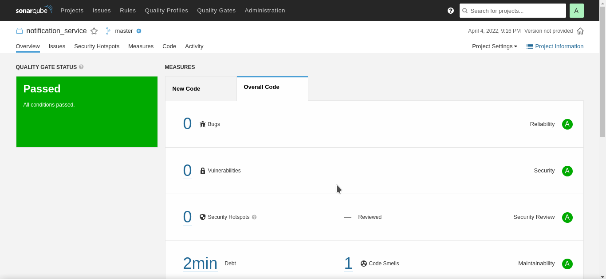

# Notification Service

- This is a service used to send Emails. Currently it logs the messages but can be extended to use a external Email API to actually send emails.

- Kafka Consumer listens to topic for any Emails to be sent. [Consumer](consumer/consumer.go)

- logs are generated in file /kafka_notification_service/notification_service.log


## Interactions

- User service publishes message on kafka for Welcome Email on user SignUp.

- Doctor service publishes message on kafka for Appointment Email when a new appointment is created.


## To Start Kafka

The Zookeeper & Broker images are defined in docker-compose.yml

to run :- 

```bash
docker-compose up
```

### Sonar 
