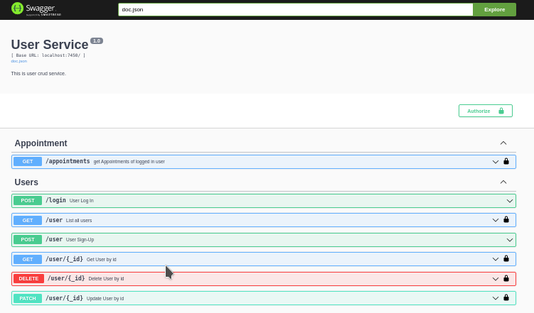
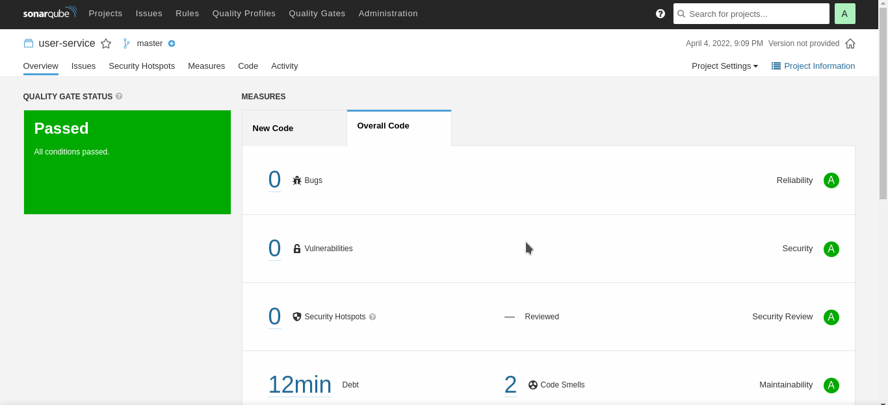

# User Service 

- User login signup also delete account
- Get all users
- Passwords are hashed using bcrypt before storing in db
- JWT token based Authentication. users can only update/delete their own account
- Get all appointments of logged in user.
- logs are generated in file /user_service/user_service.log

## Interactions
- To get all appointments of a user an rest api call is made to __doctor service__

-  On User SignUp. A msg is published on __kafka__ to send to __notification service__ for sending Welcome message . [Producer](producer/producer.go)

## Port = 7450

## Stack
- Gin
- DynamoDb
- Swagger http://localhost:7450/swagger/index.html#/

[DynamoDb Schema for user = users.json](../misc/data_models/dynamodb/users.json)

### Swagger

### Sonar

