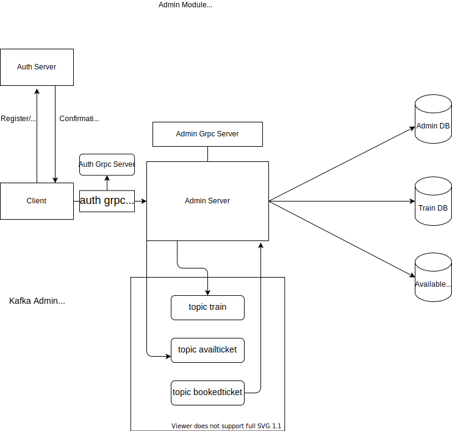
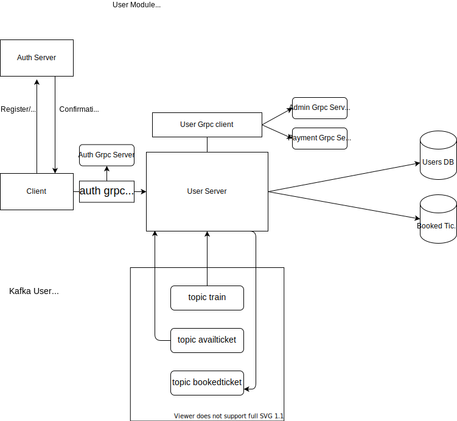
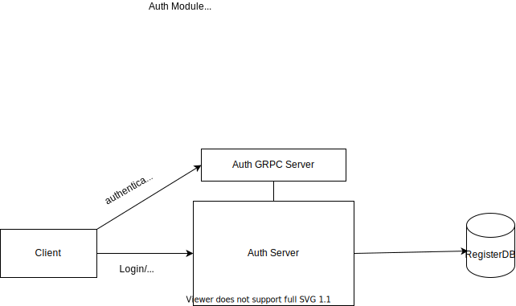
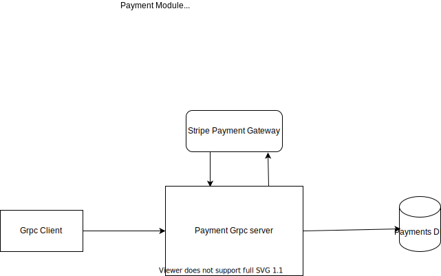

### Features Added In this API

- [x] Login with bcrypt hashing.
- [x] Access resources using JWT token 
- [x] Allows to register.
- [x] Allows Admin to add train
- [x] Allows Admin to add available ticket
- [x] Allows User to check available train
- [x] Allows User to Book a ticket
- [x] Logging support
- [x] Use Kafka to produce and consume events
- [x] Created 4 Microservices - Admin,User,Auth and Payment
- [x] Use grpc for remote procdure call
- [x] Added tests
- [x] Added Stripe Payment Gateway(testing)
- [x] Sonarqube 

## Railyatra

### Features Implemented

<li>User registration for 2 roles - Admin, User Registration
<li>REST APIs to perform CRUD operations on all two roles
<li>Mongodb to persist data
<li>Authorisation using JWT and password hashing
<li>Using kafka to communicate between different microservices
<li>Using Grpc to communicate between different microservices
<li>Integration with Stripe Payment Gateway

### Modules in the application

<li>Admin Module    - PORT 6001
<li>User Module     - PORT 6002
<li>Auth Module     - PORT 6003
<li>Payment Module  - PORT 6012 (This is a grpc server)

 

## Admin Service

 

## User Service

 

## Auth Service

 

## Payment Service

# User Service
User Service is responsible to do CRUD operations on "user" entity. It is also responsible for reciveing ticket booking input from "clients".

### Routes
| Method | Route                           |   Description                                |
|  ---   | ---                             | ---                                          |
| POST   |   /user                         |   Create a new user                          |
| GET    |   /user/:userid                 |   Read user info given userid                |
| PUT    |   /user/:userid                 |   Update user info given userid              |
| DELETE |   /user/:userid                 |   Delete user info given userid              |  
| GET    |   /users                        |   Get All Users                              |
| GET    |   /user/viewtrains              |   Get info about trains                      |
| GET    |   /user/checktrain              |   Check availibility of train given train id |
| POST   |   /bookedticket                 |   Book Ticket                                |
| GET    |   /bookedticket/:bookedticketid |   Get Booked Ticket                          |
| DELETE |   /bookedticket/:bookedticketid |   Cancel Booked Ticket                       |

# Admin Service
Admin Service is responsible to do CRUD operations on "admin" entity. It is also responsible for adding train entity and avaliable ticket entity

### Routes
| Method | Route                              |   Description                                 |
|  ---   | ---                                |  ---                                          |
| POST   |   /admin                           |   Create a new admin                          |
| GET    |   /admin/:adminid                  |   Read admin info given adminid               |
| PUT    |   /admin/:adminid                  |   Update admin info given adminid             |
| DELETE |   /admin/:adminid                  |   Delete admin info given adminid             |  
| GET    |   /admins                          |    Get All admins                             |
| POST   |   /train                           |   Create a new train                          |
| GET    |   /train/:trainid                  |   Read train info given trainid               |
| PUT    |   /train/:trainid                  |   Update train info given trainid             |
| DELETE |   /train/:trainid                  |   Delete train info given trainid             |  
| GET    |   /admin/trains                    |   Get All trains                              |
| POST   |   /availticket                     |   Create a new availticket                    |
| GET    |   /availticket/:availticketid      |   Read availticket info given availticketid   |
| PUT    |   /availticket/:availticketid      |   Update availticket info given availticketid |
| DELETE |   /availticket/:availticketid      |   Delete availticket info given availticketid |  
| GET    |   /availtickets                    |   Get All availtickets                        |

### Grpc
| Method               |   Description                                                                               |
| ---                  |   ---                                                                                       | 
| ChecKAvailticket     |   Recieve train id and checks whether corresponding avail ticket entity exist and checks whether requested number of seats exists  |

# Auth Service
Auth service is responsible fo login, registration and jwt authenticaton(grpc)

### Routes
| Method | Route                           |   Description                                |
|  ---   | ---                             |   ---                                        |
| POST   | /register                       |   Register as a User or Admin                |
| POST   | /login                          |   Login as a User or Admin                   |

### Grpc
| Method       |   Description                                                         |
| ---          |   ---                                                                 |
| Authenticate |   Receives auth token, verifies it and return confirmation            |

# Payment Service
Payment Service Responsible for Recieving payment request from other service(mainly user service)

### Grpc
| Method       |   Description                                                                               |
| ---          |   ---                                                                                       | 
| Charge       |   Recives amount,card num and communicate with stripe payment gateway and returns response  |

