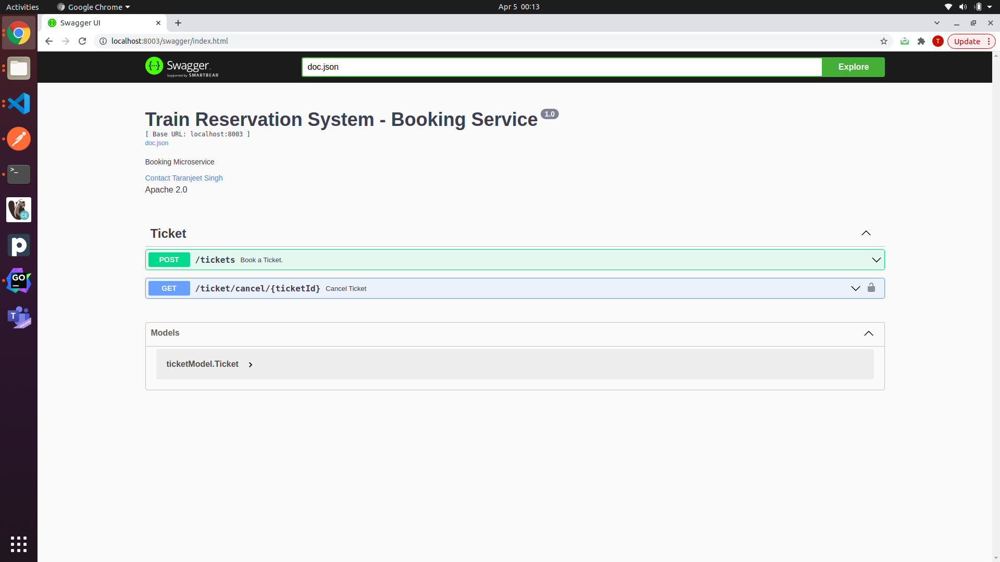
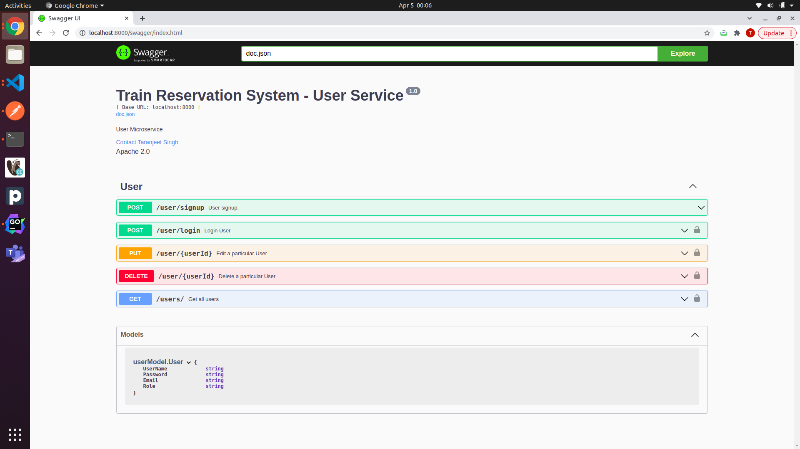
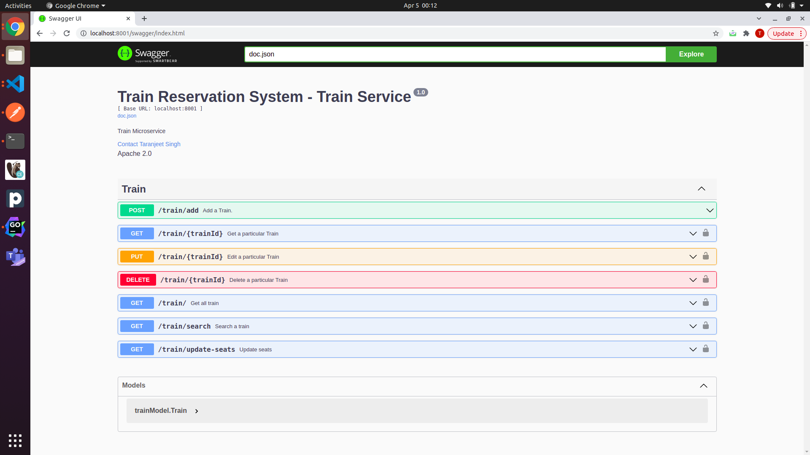

# User Service

- User SignUp
- Password Encryption
- User Login
- Token Generation
- Edit a user
- Delete a user
- Get all user

# Train Service

- Add Train
- Fetch Train
- Edit Train
- Delete a Train
- Search a train between given source and destination
- Update the reserved seats when ticket gets confirmed
- Get all train

# Booking Service

- Book Ticket
- Cancel Ticket
- Get a Ticket
- Push To Kafka when ticket is booked, for sending notification

### Tasks

- [x] APIs
- [x] Micro-service Architecture
- [x] Password Encryption
- [x] Token Creation on successful login
- [x] Kafka implementation for sending notification
- [x] Logs File
- [x] Exception Handling
- [x] User Management
- [x] Mongodb usage
- [x] Swagger UI
- [ ] Sonarcube

# Notification Service

- Send notification over email

### Swagger

